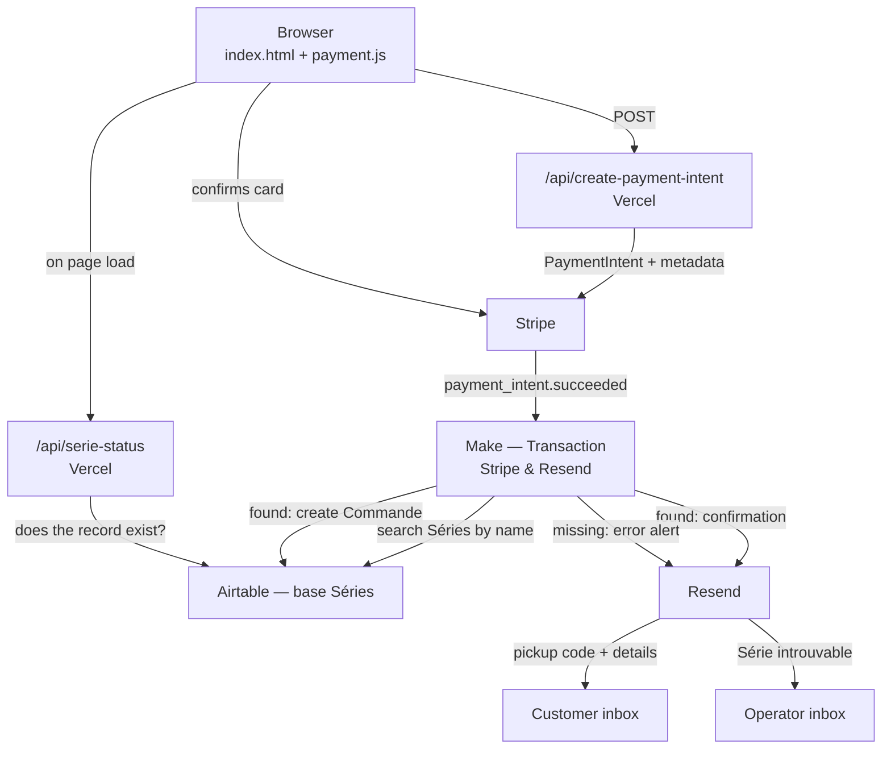

# KAJIKI — systems map

*How the five systems fit together: this repo (on Vercel), Stripe, Make, Airtable and Resend.*

*Read this when work touches anything past the repo boundary — an order that didn't log, an email that didn't arrive, a change to what Make writes, or a question about moving data between systems. Day-to-day code work doesn't need it; `CLAUDE.md` covers that.*

*Written from the live systems, not from memory. Anything here can be re-derived by inspecting Make and Airtable directly through their connectors — prefer doing that over trusting this file if the two disagree.*

---

## The whole chain

The repo owns everything up to and including the PaymentIntent. **After Stripe fires the webhook, nothing that happens is in this repo** — it's all Make. That's the boundary to keep in mind when debugging.

---

## The systems

### This repo — Vercel

Static site plus two serverless functions. Deploy is a push to `main`.

| Endpoint | Does |
|---|---|
| `POST /api/create-payment-intent` | Validates the order, computes the price server-side, creates a Stripe PaymentIntent carrying the metadata Make later reads |
| `GET /api/serie-status` | Asks Airtable whether the live série's record exists, so the button can lock before anyone opens the form. Edge-cached 30 s |

Both read `data/serie.json` directly — it's bundled at deploy, not fetched.

### Stripe

Handles the card and holds the money. Also serves as the **order ledger**: `create-payment-intent.js` sums succeeded PaymentIntents matching `series_name` + `pickup_day_short` to enforce the per-day cap, so there's no separate counter to keep in sync.

The metadata written onto each PaymentIntent is the entire payload Make gets. Nine keys — see `CLAUDE.md` for the list. They are a contract; renaming one breaks Make silently.

### Make — organisation `KAJIKI` (team `My Team`, `id 1359472`)

Two scenarios, both live, both triggering immediately.

**`Transaction ― Stripe & Resend`** (`id 5069678`) — the order pipeline.

1. **Stripe webhook** trigger, filtered to `event_type = payment_intent.succeeded`.
2. **Airtable — search Séries**, `{Name} = metadata.series_name`, max 1 record.
3. **Router**, two exclusive branches on whether that record was found:

   **Found →**
   - **Set variables.** Unpacks the Stripe metadata and builds the **pickup code**: `R-` plus the count of Commandes already linked to that Série, plus one, zero-padded under 10 → `R-01`, `R-02`…
   - **Airtable — create Commande.** Writes the code into both `Name` and `ID`, links the Série, sets `État = Payé`, and stores the Stripe PaymentIntent id.
   - **Resend — client email.** Subject `KAJIKI® — ID de Retrait`, from `contact@kajiki.fr`, to the address on the new Commande record.

   **Not found →**
   - **Resend — error alert.** Subject `KAJIKI® ― Erreur Transaction`, to the operator's personal inbox (address set in the module). Carries the série name, customer name, email and quantity so the order is recoverable by hand.

**`Email list`** (`id 5076327`) — a custom webhook named `kajiki_notifications` that validates an email against a regex and POSTs it to Resend `/contacts`. Retries once after 15 minutes on error.

> **Open question:** nothing in this repo calls that webhook — there's no email-capture form on the site. It's either driven from somewhere outside the repo or currently idle. Worth confirming before building anything that assumes a mailing list exists.

### Airtable — base `Séries` (`appestf45XMGJvLKm`)

**`Séries`** — one record per série.

| Field | Type | Note |
|---|---|---|
| `Name` | text | **The join key.** Must equal `serie.json` → `series.name` exactly |
| `Total Unités` | rollup | Sums `Unités` across linked Commandes |
| `Début`, `Fin` | date | Not currently read by the site |
| `État` | select | `En Préparation` · `En Précommande` · `Archivée` — not read by the site |
| `Commandes` | link | Reverse link; its length drives the pickup code |

**`Commandes`** — one record per paid order, all written by Make.

| Field | Type | Note |
|---|---|---|
| `Name`, `ID` | text | Both hold the same `R-NN` pickup code |
| `Unités` | number | Quantity |
| `État` | select | `Payé` → `En Préparation` → `Prêt` → `Retirée`, or `Annulée`. Make sets `Payé`; the rest is yours |
| `Jour` | select | Weekday names, from `pickup_day_short` |
| `Nom`, `Email` | text | Customer |
| `Série` | link | To the Séries record |
| `Stripe ID` | text | PaymentIntent id — the way back to the payment |

### Resend

Sends everything, from `contact@kajiki.fr`. Two transactional sends in the Transaction scenario, plus a `/contacts` audience API used by `Email list`. Connection in Make is named `Make ― Transactions & Marketing`.

Domain authentication for `kajiki.fr` (SPF/DKIM/DMARC records at the DNS host) lives in the Resend dashboard, not here — that's the first place to look for a deliverability or email-hosting problem.

---

## Where the same fact lives twice

These are the sync points. Each one is a place where a change in one system silently invalidates another.

| Fact | Lives in | Kept in sync by |
|---|---|---|
| The série name | `serie.json`, Airtable `Séries.Name`, Stripe metadata | **You**, by hand. Invariant #1 in `KAJIKI_Operations.md` |
| Confirmation email HTML | `emails/confirmation-precommande.html` **and** the Resend module in Make | **You**, by hand — see below. Verified identical as of this writing |
| Pickup day names | `serie.json` → `pickup.days[].label`, Airtable `Commandes.Jour` options | Airtable's `typecast: true` creates missing options rather than failing, so a typo silently adds a new select option |
| Per-day stock cap | `serie.json` → `pickup.days[].max_quantity`, enforced against Stripe | Nothing — Airtable has no cap field. Stripe is the only source of truth for stock |

### The email template is edited here, on purpose

`emails/confirmation-precommande.html` is the **working copy and the backup**, not an afterthought. The Make module has no version history and no way to edit HTML comfortably; the repo has both. So the workflow is deliberate:

1. Edit the template in the repo — this is where the work happens.
2. Paste it into the Resend module in the Transaction scenario.
3. Commit.

Two consequences worth stating plainly: **an edit isn't live until it's pasted into Make**, and if Make ever loses the scenario, the repo copy is what restores the email. The `{{5.variable}}` placeholders are Make variables and must survive editing intact — they're set by module 5 (`Variables`).

---

## Failure modes

| Symptom | Cause | Where it surfaces |
|---|---|---|
| Button locked despite a future deadline | Airtable `Séries` record missing or name mismatched | `/api/serie-status` returns `open: false` |
| Order paid but never logged | Same, but the customer got through anyway (gate fails open, or a race) | Error email to the operator; recover from Stripe metadata |
| Duplicate pickup codes | Two orders inside the same Make run window read the same `length(Commandes)` | Only visible in Airtable |
| Confirmation email not delivered | Resend domain auth, or the Resend module erroring | Make execution history — **7 days retention only** |
| Site charges the old price | `serie.json` deployed but browser cached | Not possible for data files; they're `no-store` |

### What catches each failure

The Transaction scenario is defended at three points, plus a scenario-level net.

| Point | On failure |
|---|---|
| **Search Séries** (module 58) | The *record missing* case is caught by the router's second branch → error email. A genuine Airtable API error has no handler here and falls through to the DLQ |
| **Create Commande** (module 68) | Error email to the operator, **then retries 3× at 15-minute intervals** |
| **Client email** (module 69) | Error email to the operator, **then retries once after 15 minutes** |
| **Error notification** (module 75) | `Break` with retry off — deliberately, so a failing alerter can't loop |
| **Scenario level** | `dlq: true`, `dataloss: false` — a run that fails anyway is stored in the dead-letter queue for manual replay rather than lost |

So an order is not silently dropped: every branch either retries, alerts, or parks the run for replay. The operator alert fires *before* the retries, so an email doesn't mean the order failed permanently — check the DLQ and the execution history before acting on one.

---

## Known gaps — unbuilt, tracked here

**The pickup code can collide.** `R-NN` is derived in Make from `length(Commandes) + 1` on the Série record, read at the moment the run executes. Two orders processed close enough together read the same count and produce the same code. It hasn't bitten at current volume — orders arrive minutes apart, not milliseconds — but the failure is silent: two customers get the same code and nothing anywhere flags it. Worth fixing before any surge in volume, or before the code is ever used as a real identifier rather than a human convenience. An Airtable autonumber field, or deriving the code from the Stripe PaymentIntent id, would both remove the race.

**A third automation has nowhere to live.** Both of Make's two free-plan scenario slots are used.

---

## Ceilings worth knowing before proposing anything

The Make organisation is on the **Free** plan:

- **1 000 operations/month.** One order costs roughly 5 (trigger, search, variables, create, send). That's ~200 orders/month before the plan is the binding constraint, and the `Email list` scenario eats from the same budget.
- **2 scenarios maximum** — both are used. A third automation needs a paid plan or a merge into an existing scenario.
- **7-day execution retention**, 3-day webhook logs. A bug reported later than a week is not diagnosable from Make history.
- 15-minute minimum interval, 5-minute max execution time.

Airtable and Resend free tiers are not close to binding at current volume; Make is.

---

## Configuration inventory

Names and locations only — **no values in this file, ever.**

| Setting | Lives in | Used by |
|---|---|---|
| `STRIPE_SECRET_KEY` | Vercel env | Both API routes |
| `AIRTABLE_TOKEN`, `AIRTABLE_BASE_ID`, `AIRTABLE_SERIES_TABLE`, `AIRTABLE_SERIES_NAME_FIELD` | Vercel env | `serie-status.js` only. All four required or the gate silently skips |
| `window.KAJIKI_STRIPE_PK` | inline in `index.html` | Stripe.js — publishable, safe in source |
| `ALLOWED_ORIGINS` | `api/create-payment-intent.js` | Origin allowlist |
| Stripe webhook → Make | Stripe dashboard | Triggers the Transaction scenario |
| Airtable + Resend connections | Make | Both scenarios |
| `kajiki.fr` SPF/DKIM/DMARC | DNS host, verified in Resend | All outbound mail |

---

## If you're asked to move série data into Airtable

The groundwork is already there, which is why this comes up: the `Séries` table has `Début`, `Fin` and `État`, and none of them are read by the site today. `serie.json` and Airtable currently overlap on the série name alone.

Three things to weigh before designing it:

1. **`serie.json` is `require`d at build, not fetched.** Both API routes import it directly. Moving to Airtable means a runtime fetch on the payment path — the one path that must not get slower or less reliable.
2. **Airtable has no equivalent of `preorder_deadline_iso`, `price_per_unit_cents` or the per-day pickup windows.** Those fields would have to be added, and the price moving into Airtable means a mis-typed cell can mis-charge — today that risk is caught by code review on a commit.
3. **It would make Airtable a hard dependency of ordering.** Right now the Airtable gate deliberately fails open precisely so Airtable being down can't stop sales.

A middle path worth considering: keep price and deadline in `serie.json` where they're version-controlled and reviewable, and read only the descriptive fields (dates, état) from Airtable.
